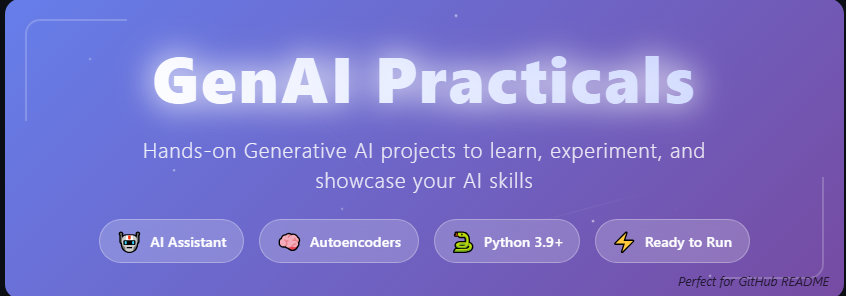

# GenAI Practicals 🚀

<p align="center">
  
</p>

<p align="center">
  <strong>Hands-on Generative AI projects to learn, experiment, and showcase your AI skills</strong>
</p>

<div align="center">


</div>

---

## 🎯 What You'll Build

This repository contains **production-ready AI projects** that you can run, modify, and deploy. Each project is designed to teach core GenAI concepts through practical implementation.

### 🤖 Project 1: AI Assistant
Build your own conversational AI with customizable personality and extensible functionality.

### 🧠 Project 2: Autoencoder System  
Implement neural networks for data compression, anomaly detection, and reconstruction.

---

## 🏗️ Repository Structure

```
GenAI-Practicals/
├── 📁 AI-Assistant-1/
│   ├── 🐍 app.py                 # Main application logic
│   ├── 📋 requirements.txt       # Python dependencies
│   ├── 📝 README.md             # Project-specific docs
│   └── 📂 utils/                # Helper functions
├── 📁 Autoencoder-Program-2/
│   ├── 🧠 train.py              # Training script
│   ├── 📊 model.py              # Network architecture
│   ├── 📋 requirements.txt      # Python dependencies
│   ├── 📝 README.md            # Project-specific docs
│   └── 📂 data/                # Sample datasets
├── 📄 LICENSE
└── 🚀 README.md                # This file
```

---

## ⚡ Quick Start

### Prerequisites
- Python 3.9 or higher
- Git installed on your system

### Installation

1. **Clone the repository**
   ```bash
   git clone https://github.com/YourUsername/GenAI-Practicals.git
   cd GenAI-Practicals
   ```

2. **Set up virtual environment** (recommended)
   ```bash
   python -m venv genai-env
   
   # Activate environment
   # On Windows:
   genai-env\Scripts\activate
   # On macOS/Linux:
   source genai-env/bin/activate
   ```

3. **Choose your project and install dependencies**
   ```bash
   # For AI Assistant
   cd AI-Assistant-1
   pip install -r requirements.txt
   
   # For Autoencoder
   cd ../Autoencoder-Program-2
   pip install -r requirements.txt
   ```

---

## 🤖 Project 1: AI Assistant

<p align="center">
  
</p>

### Features
- 💬 **Natural Conversation Flow** - Powered by advanced prompt engineering
- 🎭 **Customizable Personality** - Easily modify AI behavior and responses
- 🔧 **Extensible Architecture** - Add APIs, tools, and external integrations
- 🚀 **Ready for Production** - Clean code structure for real-world deployment

### Usage
```bash
cd AI-Assistant-1
python app.py
```

### Key Technologies
- **Core**: Python, Natural Language Processing
- **Optional**: OpenAI API, Hugging Face Transformers
- **UI Options**: Streamlit, Gradio, or CLI interface

---

## 🧠 Project 2: Autoencoder System

<p align="center">
  
</p>

### Features
- 🗜️ **Data Compression** - Learn efficient data representations
- 🔍 **Anomaly Detection** - Identify outliers and unusual patterns
- 🎨 **Denoising Capabilities** - Remove noise from corrupted data
- 📈 **Flexible Architecture** - Experiment with different network designs

### Usage
```bash
cd Autoencoder-Program-2
python train.py --epochs 50 --dataset ./data/sample_data.csv
```

### Key Technologies
- **Deep Learning**: PyTorch or TensorFlow
- **Data Processing**: NumPy, Pandas, scikit-learn
- **Visualization**: Matplotlib, Seaborn

---

## 🛠️ Technology Stack

| Category | Technologies |
|----------|-------------|
| **Language** |  |
| **Deep Learning** |   |
| **Data Science** |   |
| **Visualization** |   |
| **Web UI** |   |

---

## 🎯 Real-World Applications

### AI Assistant Use Cases
- **Customer Service Chatbots** - Automated support systems
- **Educational Tutors** - Personalized learning assistants  
- **Content Generation** - Writing and creative assistance
- **Task Automation** - Workflow optimization tools

### Autoencoder Applications
- **Fraud Detection** - Financial transaction monitoring
- **Quality Control** - Manufacturing defect identification
- **Data Storage** - Efficient compression algorithms
- **Image Enhancement** - Noise reduction and restoration

---

## 🗺️ Project Roadmap

### Phase 1: Core Features ✅
- [x] Basic AI Assistant implementation
- [x] Autoencoder training pipeline
- [x] Documentation and examples

### Phase 2: Enhanced Features 🚧
- [ ] **GPT Integration** - Advanced language model support
- [ ] **Web Dashboards** - Streamlit/Gradio interfaces
- [ ] **Pre-trained Models** - Ready-to-use model weights
- [ ] **Sample Datasets** - Curated training data

### Phase 3: Production Ready 📋
- [ ] **Cloud Deployment** - AWS, GCP, Hugging Face guides
- [ ] **Docker Containers** - Containerized deployments
- [ ] **API Endpoints** - REST API implementations
- [ ] **Performance Optimization** - Speed and efficiency improvements

### Phase 4: Community 🌟
- [ ] **Video Tutorials** - Step-by-step walkthroughs
- [ ] **Blog Posts** - Technical deep-dives
- [ ] **Community Challenges** - Collaborative projects

---

## 🤝 Contributing

We welcome contributions from the community! Here's how you can help:

### Ways to Contribute
- 🐛 **Bug Reports** - Found an issue? Let us know!
- 💡 **Feature Requests** - Suggest new functionality
- 📝 **Documentation** - Improve guides and examples
- 🔧 **Code Contributions** - Submit pull requests

### Contribution Process
1. **Fork** the repository
2. **Create** a feature branch: `git checkout -b feature/amazing-feature`
3. **Commit** your changes: `git commit -m 'Add amazing feature'`
4. **Push** to branch: `git push origin feature/amazing-feature`
5. **Open** a Pull Request

### Development Setup
```bash
# Clone your fork
git clone https://github.com/YourUsername/GenAI-Practicals.git
cd GenAI-Practicals

# Install development dependencies
pip install -r requirements-dev.txt

# Run tests
python -m pytest tests/

# Check code style
flake8 . --max-line-length=88
black . --check
```

---

## 📚 Learning Resources

### Recommended Reading
- **Books**: "Hands-On Machine Learning" by Aurélien Géron
- **Papers**: "Attention Is All You Need" (Transformer architecture)
- **Courses**: Fast.ai Deep Learning for Coders

### Community
- **Discord**: Join our community chat
- **Reddit**: r/MachineLearning discussions
- **Twitter**: Follow [@YourHandle] for updates

---

## 📄 License

This project is licensed under the **MIT License** - see the [LICENSE](LICENSE) file for details.

### What this means:
- ✅ **Commercial use** - Use in commercial projects
- ✅ **Modification** - Adapt and change the code
- ✅ **Distribution** - Share with others
- ✅ **Private use** - Use for personal projects
- ❗ **License notice** - Include original license

---

## 🙏 Acknowledgments

- **OpenAI** - For advancing the field of AI
- **Hugging Face** - For democratizing ML models
- **PyTorch Team** - For the excellent deep learning framework
- **Community Contributors** - For making this project better

---

## 📞 Support & Contact

### Get Help
- 📖 **Documentation**: Check project README files
- 🐛 **Issues**: [GitHub Issues](https://github.com/YourUsername/GenAI-Practicals/issues)
- 💬 **Discussions**: [GitHub Discussions](https://github.com/YourUsername/GenAI-Practicals/discussions)

### Stay Connected
- 🌟 **Star this repo** if it helped you!
- 🐦 **Follow me** on   [](https://www.linkedin.com/in/aditya-singh-7210b2267/) [](https://www.instagram.com/thakuraditya00007/)  
- 📧 **Email**: adssingh9090@gmail.com

---

<div align="center">

**Made with ❤️ by the GenAI Practicals Team**

[⭐ Star](https://github.com/YourUsername/GenAI-Practicals/stargazers) • [🍴 Fork](https://github.com/YourUsername/GenAI-Practicals/fork) • [📝 Issues](https://github.com/YourUsername/GenAI-Practicals/issues) • [💬 Discussions](https://github.com/YourUsername/GenAI-Practicals/discussions)

</div>
